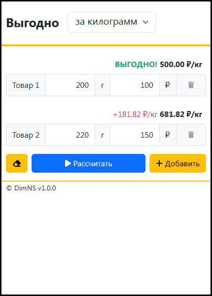

# Выгодно

## Установка на Android
1. Открыть Google Chrome
2. Перейти по адресу https://dimns.github.io/vygodno/
3. Нажать на три точки и выбрать пункт "Установить на главный экран"
4. После этого приложение будет установлено и появится ярлык на главной экране
